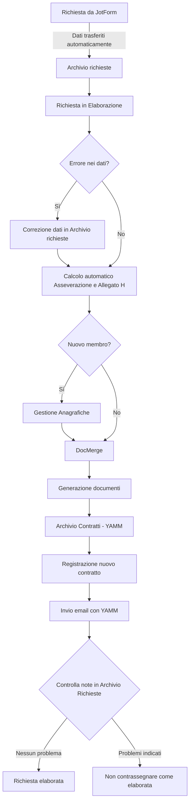

# ConcordatoFacile: Guida introduttiva

Benvenuto alla guida di ConcordatoFacile, un sistema che semplifica la gestione dei contratti di locazione a canone concordato per le associazioni di categoria. Questa soluzione innovativa si basa su un insieme di componenti IT all'avanguardia che lavorano in sinergia per garantire un'esperienza utente efficiente, sicura e automatizzata. Attraverso una simulazione completa del processo di gestione di una richiesta di assistenza per un contratto di locazione a canone concordato, questa guida ti mostrerà come funziona ConcordatoFacile e come può rendere il tuo lavoro notevolmente più semplice.

Per utilizzare ConcordatoFacile in modo efficace, è consigliabile avere una buona dimestichezza in materia di contratti di locazione a canone concordato. Questo sistema è stato progettato per semplificare la gestione di tali contratti, ma richiede una conoscenza di base delle pratiche e delle normative legate a questo tipo di locazioni.

ConcordatoFacile permette un'ampia gamma di personalizzazioni: prima di procedere con l'implementazione, è fondamentale che il sistema venga configurato per rispondere alle specifiche esigenze della tua associazione. Ti invito quindi a visitare https://concordatofacile.carrd.co per contattarmi e discutere la configurazione più adatta alle tue necessità. Al contempo, è importante sottolineare che questa guida fornisce un punto di partenza generale per la tua esperienza con ConcordatoFacile: la versatilità di questa soluzione nell'adattarsi alle tue specifiche esigenze potrebbe comportare aspetti unici nel tuo caso che non sono esplicitamente descritti qui. Se dovessero emergere processi non coperti da questa guida o se avessi domande specifiche riguardanti la tua configurazione di ConcordatoFacile, non esitare a contattarmi all'indirizzo email [germ.riccio@gmail.com](mailto:germ.riccio@gmail.com). Sarà un piacere assisterti affinché tu possa sfruttare al meglio tutte le funzionalità di questo strumento.

> 💡 Il successo nella gestione dei contratti di locazione a canone concordato per la tua associazione risiede nella precisione. Assicurati di seguire attentamente le istruzioni presenti in questa guida per garantire il corretto funzionamento del sistema.

## Indice

1. [Glossario](#glossario)
1. [Diagramma di flusso](#diagramma-di-flusso)
2. [Archivio richieste](#archivio-richieste)
3. [Richiesta in elaborazione](#richiesta-in-elaborazione)
4. [Gestione anagrafiche](#gestione-anagrafiche)
5. [DocMerge](#docmerge)
6. [Archivio contratti - YAMM](#archivio-contratti---yamm)
7. [Contratti in scadenza](#contratti-in-scadenza)
8. [Pannello di controllo](#pannello-di-controllo)

## Glossario

Prima di iniziare, è utile familiarizzare con alcune delle componenti chiave utilizzate in ConcordatoFacile. Di seguito è presente un glossario che fornisce una descrizione dettagliata di ciascuna di queste componenti.

### Google Drive

Google Drive fornisce un servizio di archiviazione cloud offerto da Google. Questo servizio ti permette di conservare i tuoi dati e documenti in un ambiente sicuro e affidabile. In ConcordatoFacile, Google Drive funge da deposito centrale per tutti i file e i documenti relativi ai contratti di locazione. Questo comprende i moduli compilati, i contratti generati e qualsiasi altro documento pertinente. L'utilizzo di Google Drive assicura che i documenti siano sempre disponibili, accessibili da qualsiasi dispositivo connesso a Internet e protetti da eventuali perdite di dati.

### Google Sheets

Google Sheets è un'applicazione basata su cloud per fogli di calcolo fornita da Google. A differenza di Microsoft Excel, questa applicazione consente di accedere e modificare i dati da qualsiasi dispositivo con una connessione Internet. In ConcordatoFacile, Google Sheets viene utilizzato per gestire, analizzare ed elaborare i dati raccolti tramite JotForm. Inoltre, Google Sheets funge da interfaccia per interagire con altre componenti del sistema, come DocVariables e YAMM.

### JotForm

JotForm è uno strumento online che consente di creare moduli personalizzati. Questo strumento offre una vasta gamma di opzioni di personalizzazione, rendendolo adatto a diverse applicazioni. Nel contesto di ConcordatoFacile, JotForm viene utilizzato per raccogliere le informazioni necessarie alla creazione del contratto di locazione. Queste informazioni vengono raccolte attraverso un modulo online, che può essere compilato dai proprietari di immobili, dagli inquilini o dalle agenzie immobiliari. Una volta compilato, il modulo viene inviato a Google Sheets per essere elaborato.

### DocVariables

DocVariables è uno strumento che consente la generazione automatica di documenti. È stato progettato per semplificare il processo di creazione di documenti personalizzati, eliminando la necessità di copiare e incollare manualmente le informazioni da una fonte all'altra. Nel contesto specifico di ConcordatoFacile, DocVariables sfrutta i dati raccolti tramite JotForm e gestiti in Google Sheets per creare un documento completo e personalizzato, che include il contratto di locazione. Questo processo automatizzato assicura che il documento generato sia pronto per essere condiviso immediatamente con tutte le parti coinvolte nel contratto di locazione, rendendo il processo di condivisione rapido ed efficiente.

### Yet Another Mail Merge (YAMM)

Yet Another Mail Merge, o YAMM, è uno strumento che consente di inviare email personalizzate in modo automatizzato. Questo strumento risulta particolarmente utile quando si ha la necessità di inviare email a un gran numero di destinatari contemporaneamente, ma si desidera comunque personalizzare il contenuto per ciascun ricevente. Nel contesto di ConcordatoFacile, YAMM viene impiegato per utilizzare i dati gestiti in Google Sheets al fine di inviare i contratti di locazione tramite email. Questo approccio garantisce una comunicazione rapida e professionale con tutte le parti coinvolte.

Ora che hai una comprensione di base delle componenti chiave di ConcordatoFacile, possiamo procedere con la guida.

## Diagramma di flusso

La seguente rappresentazione grafica mostra il percorso che una richiesta attraversa dal momento in cui viene ricevuta, fino alla sua completa evasione, delineando i vari passaggi intermedi e le relative procedure automatiche. Ogni elemento del diagramma di flusso sottostante sarà successivamente dettagliato nelle sezioni successive.

## Archivio richieste

ConcordatoFacile usa un modulo JotForm per raccogliere tutte le informazioni necessarie dagli utenti che richiedono assistenza per i contratti di locazione a canone concordato. Puoi inviare il modulo via email o integrarlo direttamente sul sito web della tua associazione. Questo metodo ti permetterà di gestire in modo efficiente un alto volume di richieste, mantenendo tutte le informazioni ordinate e accessibili in un unico luogo: il foglio elettronico “Archivio richieste”.

| Panoramica del modulo JotForm |
|:--|
|  |

Quando un utente invia una richiesta tramite JotForm, il sistema trasferisce automaticamente le informazioni fornite e le registra in "Archivio richieste". Ogni invio di un modulo JotForm costituisce una singola riga all'interno di questo foglio, con i dati forniti dagli utenti accuratamente organizzati in colonne distinte.

| Panoramica del foglio "Archivio richieste" |
|:--|
|  |

Nel foglio "Archivio richieste", ci sono due colonne di primaria importanza a cui è fondamentale prestare attenzione:

- "Completata?" (Colonna A): Se inserisci "sì" in questa cella, il modulo JotForm associato viene considerato come gestito e, di conseguenza, rimosso dalla lista delle attività in sospeso.
- "Note" (Colonna B): Questa colonna è destinata a contenere eventuali osservazioni o commenti pertinenti al modulo JotForm. È il luogo ideale per registrare dettagli aggiuntivi o annotare promemoria.

È fondamentale gestire attentamente la colonna "Completata?" al fine di mantenere un flusso di lavoro efficiente e ben organizzato. Quando hai concluso la gestione di un modulo e non sono necessarie ulteriori azioni, scrivi "sì" in questa cella. Tale azione indicherà che la richiesta è stata completamente trattata e la rimuoverà dalla lista delle attività pendenti. Al contrario, se un modulo richiede ancora attenzione, lascia questa cella vuota.

| Impostando "sì" sotto la colonna "Completata?" nel foglio 'Archivio richieste', il conteggio di "Richieste da Elaborare" nel foglio "Pannello di Controllo" si aggiorna automaticamente |
|:--|
|  |

| Sebbene i dati nel foglio "Archivio richieste" vengano inseriti automaticamente, hai sempre la possibilità di correggerli o modificarli nel caso l'utente abbia commesso degli errori o abbia cambiato idea. |
|:--|
|  |

### Pronto a procedere?

Fino a questo punto, abbiamo esaminato come ricevere una richiesta e come gestire le informazioni iniziali nel foglio "Archivio richieste". Tuttavia, ci sono ancora diversi passaggi da completare prima che una richiesta possa essere considerata effettivamente "Completata". Continua a leggere per scoprire quali sono i passaggi successivi da seguire per gestire una richiesta in modo veloce e accurato.

## Richiesta in Elaborazione

Il foglio "Richiesta in Elaborazione" presenta la richiesta meno recente inviata tramite JotForm e ancora in sospeso - essenzialmente, la più datata nella coda di lavoro. In questo quadro, avrai l'opportunità di esaminare tutti i dati inseriti dagli utenti e verificare la presenza di eventuali errori, che verranno resi visibili nelle colonne evidenziate in giallo. Qualora riscontrassi imprecisioni, potrai tornare al foglio "Archivio richieste" per correggere i dati. Questo foglio non è destinato unicamente al monitoraggio dei dati inviati dagli utenti, ma anche per effettuare i calcoli indispensabili per la generazione dell'asseverazione e dell'allegato H.

| Panoramica del foglio "Richiesta in elaborazione" |
|:--|
|  |

| Per quanto riguarda i calcoli: se l'immobile in questione si trova in un comune presente nel database di ConcordatoFacile, i valori minimi e massimi dell'area omogenea cui appartiene saranno identificati automaticamente dal sistema. Nel caso in cui il comune non fosse incluso nel database, riceverai una notifica. |
|:--|
|  |

In tale circostanza, dovrai verificare, consultando gli accordi territoriali pertinenti, la correttezza dei dati forniti dagli utenti. All'occorrenza, potrai apportare modifiche nel foglio "Archivio richieste" come precedentemente indicato. Per individuare rapidamente la richiesta in lavorazione, copia il "Submission ID" dal foglio "Richiesta in Elaborazione" e cercalo nel foglio "Archivio richieste", come illustrato nel seguente video.

| ⚠️ Per cercare una stringa specifica in Google Sheets, utilizza la combinazione di tasti "Ctrl + F" (o "Cmd + F" su Mac). Inserisci la stringa nella casella di ricerca che appare e Sheets evidenzierà automaticamente le corrispondenze trovate nel foglio di lavoro corrente |
|:--|
|  |

## Gestione anagrafiche

| Se una richiesta di assistenza perviene da un utente non registrato all'associazione, un messaggio di errore apparirà nel foglio "Richiesta in Elaborazione". |
|:--|
|  |

In tale evenienza, vai al foglio "Gestione Anagrafiche" per registrare il nuovo membro o rinnovare la sua iscrizione. Da qui potrai anche monitorare lo stato di iscrizione di tutti i membri.

"Gestione Anagrafiche" è composto da diverse colonne, ciascuna con uno specifico scopo. Ecco una panoramica delle informazioni presenti nel foglio:

1. **ID Membro**: Questa colonna contiene l'identificativo univoco assegnato a ciascun membro dell'associazione.

2. **Cognome**: La colonna "Cognome" mostra il cognome del membro.

3. **Nome**: La colonna "Nome" indica il nome del membro.

4. **Data di nascita**: Questa colonna indica la data di nascita del membro.

5. **Codice fiscale / P. IVA**: La colonna "Codice fiscale / P. IVA" contiene il codice fiscale o la partita IVA del membro.

6. **Email**: Questa colonna rappresenta l'indirizzo email del membro.

7. **Telefono fisso**: La colonna "Telefono fisso" mostra il numero di telefono fisso del membro.

8. **Telefono cellulare**: Questa colonna indica il numero di telefono cellulare del membro.

9. **Note**: La colonna "Note" consente di aggiungere annotazioni o informazioni aggiuntive sul membro.

10. **Data iscrizione**: Questa colonna indica la data in cui il membro si è iscritto all'associazione.

11. **Data scadenza**: La colonna "Data scadenza iscrizione" mostra la data prevista per la scadenza dell'iscrizione del membro.

12. **Scade tra quanti giorni?**: Questa colonna calcola il numero di giorni rimanenti fino alla scadenza dell'iscrizione del membro.

13. **Scaduta?**: La colonna "Scaduta?" indica se l'iscrizione del membro è già scaduta. Se la scadenza è trascorsa, verrà visualizzato "Sì"; altrimenti, verrà visualizzato "No".

14. **Totale contratti**: La colonna "Totale contratti" conta il numero totale di contratti associati a ciascun membro.

15. **Contratti in scadenza**: La colonna "Contratti in scadenza" conta il numero di contratti che scadranno entro i prossimi 30 giorni per ciascun membro.

16. **⚠️ Avvisi**: Questa colonna contiene formule che verificano la correttezza dei dati inseriti e forniscono avvisi in caso di eventuali errori o problemi. Gli avvisi includono campi vuoti, formattazione errata dei dati e presenza di duplicati.

| ⚠️ Segui questi passaggi per inserire un nuovo membro nel database degli iscritti: |
|:--|
| 1. Clicca su "Estensioni" nella barra del menu. |
| 2. Seleziona "Macro" dal menu a discesa che appare. |
| 3. Nella finestra delle macro, scegli l'opzione "Nuova iscrizione" per avviare la creazione di una nuova iscrizione nel database. Assicurati di inserire i dati richiesti in modo accurato e completo. |
|  |

Nelle colonne gialle, che evidenziano possibili problematiche, noterai un errore sulla riga del nuovo iscritto che indica l'assenza di un contratto collegato a questo membro. Non c'è bisogno di preoccuparsi: nei passaggi successivi genereremo e archivieremo il contratto di locazione a canone concordato mancante. Una volta completate queste operazioni, l'avviso di errore scomparirà.

Una volta completata la registrazione del nuovo membro, torna al foglio "Richiesta in Elaborazione" e accertati che il valore di "Totale Errori" sia 0, quindi attiva i calcoli iterativi come illustrato nel video sottostante e attendi che "Sì" compaia nella cella sotto "Procedere con DocMerge?". Al comparire del "Sì", procedi cliccando su "DocMerge".

| ⚠️ Segui questi passaggi per gestire i calcoli iterativi e evitare rallentamenti al foglio elettronico: |
|:--|
| - Per attivare i calcoli iterativi: |
|   1. Fai clic sull'icona "File" nella barra del menu. |
|   2. Seleziona "Impostazioni" dal menu a discesa. |
|   3. Nella finestra delle impostazioni, fai clic su "Calcolo". |
|   4. Imposta l'opzione "Calcolo iterativo" su "on". |
|   5. Fai clic su "Salva impostazioni". |
| - Per disattivare i calcoli iterativi: |
|   1. Segui gli stessi primi tre passaggi sopra menzionati. |
|   2. Trova l'opzione "Calcolo iterativo" e impostala su "off". |
|   3. Fai clic su "Salva impostazioni". |
| ⚠️ **Dopo aver generato i documenti contenenti l'asseverazione e l'allegato H, è indispensabile disattivare i calcoli iterativi per evitare rallentamenti indesiderati al foglio elettronico.** |
|  |

Nelle prossime fasi, esplorerai il processo di generazione automatica dei documenti necessari per completare la richiesta. Scoprirai come archiviarli correttamente e come registrare l'operazione e i file appena generati nel foglio "Archivio Contratti - YAMM". Questi passaggi non solo semplificano e accelerano l'invio della documentazione alle parti coinvolte, ma implementano anche un efficiente sistema di monitoraggio per tutte le scadenze dei contratti di locazione, consentendoti di notificare i membri della tua associazione in modo tempestivo.

## DocMerge

| Dopo aver cliccato su "DocMerge", vedrai un documento analogo a quello mostrato nello screenshot sottostante. |
|:--|
|  |

| ⚠️ Per generare i documenti, segui i passaggi mostrati nel video sottostante. DocVariables utilizzerà i dati contenuti in Google Sheets per generare i documenti, basandosi sui dati elaborati dal sistema e da te revisionati. |
|:--|
| 1. Clicca su "Estensioni". |
| 2. Seleziona "DocVariables" per avviare DocVariables. |
| 3. Clicca su "DocMerge" per avviare la funzione DocMerge. |
| 4. Fai clic su "Run Now" per avviare il processo di trasferimento dei dati da Google Sheets. |
| 5. Clicca sul link blu a destra di "Export Folder" per accedere alla cartella in cui è stata archiviata la documentazione generata automaticamente. |
|  |

| Apri la cartella dove è archiviata la documentazione generata automaticamente e ordina i file dal più recente al più vecchio per posizionare in cima alla lista i documenti appena generati. Identifica e apri questi nuovi documenti, poi revisiona il loro contenuto. Se necessario, puoi ancora effettuare modifiche: il file è in un formato editabile. Nell'esempio specifico, la documentazione è archiviata in una cartella denominata 'output' e tra i documenti generati da DocVariables, oltre al contratto di locazione, all'asseverazione e all'allegato H, noterai anche la presenza di una ricevuta e del modulo di iscrizione all'associazione |
|:--|
|  |

## Archivio contratti - YAMM

Bene, i documenti sono stati generati correttamente. È il momento di tornare a Google Sheets per registrare l'operazione appena effettuata. Prima di procedere, come già indicato, **disattivare i calcoli iterativi se sono ancora attivi è un passaggio obbligatorio**. Conclusa questa operazione, accedi al foglio di calcolo "Archivio contratti - YAMM" e avvia il processo di registrazione di un nuovo contratto, seguendo le istruzioni presenti nel video seguente.

| ⚠️ Ecco come registrare l'ultimo contratto generato nel database dei contratti: |
|:--|
| 1. Clicca su "Estensioni" nella barra del menu. |
| 2. Seleziona "Macro" dal menu a discesa che appare. |
| 3. Quando si apre la finestra delle macro, scegli l'opzione "Nuovo contratto". |
|  |

Il foglio di calcolo "Archivio Contratti - YAMM" è stato pensato per offrire un solido supporto nell'archiviazione dei contratti di locazione della tua associazione. Oltre a conservare ordinatamente le informazioni contrattuali, consente anche di semplificare e rendere più efficiente la comunicazione con i membri iscritti, tramite un sistema automatizzato.

È composto dalle seguenti colonne:

1. **ID Contratto**: Questa colonna contiene un identificativo unico per ogni contratto e ti permette di distinguere facilmente un contratto dall'altro.

2. **ID Membro**: Questa colonna contiene un identificativo unico per ogni membro dell'associazione. Questo permette di identificare rapidamente i contratti associati a ciascun membro.

3. **Tipo di Contratto**: Questa colonna descrive la natura del contratto di locazione.

4. **Data Decorrenza e Data Scadenza**: Queste colonne indicano rispettivamente la data di decorrenza e la data di scadenza del contratto di locazione.

5. **Avviso di Scadenza Inviato**: In questa colonna, devi indicare se hai inviato un avviso di scadenza del contratto di locazione all'associato. È necessario specificare "Si" se hai inviato l'avviso, oppure "No" se non lo hai ancora inviato. Assicurati di inserire la risposta corretta per ogni contratto. Questa informazione è fondamentale per tenere traccia degli avvisi inviati e assicurarsi che i membri ricevano le comunicazioni necessarie.

6. **Email**: Questa colonna contiene l'indirizzo email del membro. Questo indirizzo viene utilizzato per inviare la documentazione e gli avvisi di scadenza.

7. **Attachment**: Questa colonna contiene il contratto di locazione e tutta la documentazione che verrà allegata all'email.

8. **Merge status**: La colonna "Merge Status" nel foglio di calcolo è molto importante perché indica lo stato di invio delle email. Quando YAMM invia un'email, aggiorna questa colonna con informazioni sullo stato dell'email, come "sent" (inviata), "opened" (aperta), "clicked" (cliccata) o "responded" (risposta ricevuta). Questo ti permette di monitorare facilmente l'efficacia delle tue email e di vedere chi ha aperto o risposto alle tue comunicazioni.

9. **⚠️ Avvisi**: La colonna "⚠️ Avvisi" è un ulteriore strumento di controllo che verifica la presenza di tutti i dati essenziali nel foglio di calcolo. Se mancano dati importanti, come l'ID Membro, l'Email o l'Avviso di Scadenza Inviato, questa colonna restituirà un messaggio di errore, permettendoti di identificare e correggere rapidamente eventuali problemi.

### Configurazione di Gmail per l'uso con YAMM

Per utilizzare efficacemente Yet Another Mail Merge (YAMM), è fondamentale capire come configurare correttamente Gmail. Di seguito ti illustro i passaggi in modo più dettagliato.

Prima di tutto, dovrai creare una bozza di email all'interno di Gmail. Questa bozza fungerà da modello per tutte le email che prevedi di inviare tramite YAMM. Quindi, è importante che tu includa tutte le informazioni necessarie che desideri condividere con i tuoi destinatari. Puoi personalizzare il modello come preferisci, includendo testo, immagini, link e altro ancora.

Una funzionalità chiave di YAMM è la sua capacità di utilizzare dei 'marcatori' che permettono di personalizzare le email in base ai destinatari. I marcatori sono essenzialmente riferimenti ai titoli delle colonne nel tuo foglio di calcolo Google Sheets. Questi titoli di colonna rappresentano vari tipi di informazioni sui tuoi destinatari, come il loro nome, indirizzo email e qualsiasi altro dato che hai raccolto.

Per inserire un marcatore nel tuo modello di email, inseriscilo tra doppie parentesi graffe, come {{Nome}} o {{Email}}. Quando YAMM invia le tue email, sostituirà automaticamente questi marcatori con le informazioni corrispondenti dal foglio di calcolo. Ad esempio, se hai un marcatore {{Nome}}, YAMM lo sostituirà con il nome specifico del destinatario per ciascuna email che invii. Questo ti permette di inviare email personalizzate su larga scala, risparmiando tempo e fatica.

Ricorda, tuttavia, che per far funzionare correttamente YAMM, dovrai garantire che i titoli delle tue colonne nel foglio di calcolo corrispondano esattamente ai marcatori che hai inserito nel tuo modello di email. Qualsiasi discrepanza potrebbe causare errori o mancata corrispondenza dei dati durante l'invio delle email.

Nel video che segue, ti illustrerò come inviare una serie di email usando una bozza preimpostata in Gmail.

| ⚠️ Per avviare l'invio di email con YAMM, segui questi passaggi: |
|:--|
| 1. Clicca su "Estensioni". |
| 2. Clicca su "Yet Another Mail Merge". |
| 3. Clicca su "Start mail merge". |
| 4. Seleziona la bozza di email da utilizzare. |
| 5. Clicca su "Add Alias, filters, personalized attachments...". |
| 6. Seleziona "Attach files in column H to emails sent." |
| 7. Clicca su "Back". |
| 8. Clicca su "Send emails" per avviare l'invio delle email. |
|  |

## Contratti in scadenza

| Il foglio "Contratti in scadenza" mostra una lista dei contratti di locazione le cui scadenze sono previste nei prossimi 30 giorni. L'obiettivo del foglio è tenere traccia delle scadenze imminenti e delle relative notifiche inviate ai membri dell'associazione. |
|:--|
|  |

È composto dalle seguenti colonne:

1. **ID Membro**: Questa colonna rappresenta l'identificativo univoco del membro associato al contratto.

2. **ID Contratto**: In questa colonna viene indicato l'identificativo univoco del contratto.

3. **Data Scadenza**: La colonna "Data Scadenza" mostra la data di scadenza prevista per il contratto di locazione.

4. **Avviso di scadenza inviato**: Questa colonna indica se è stato inviato un avviso di scadenza al membro associato al contratto. Se il valore è "Sì", significa che è stato inviato un avviso di scadenza. Se il valore è "No", significa che non è stato ancora inviato un avviso.

Il foglio filtra automaticamente i contratti presenti nel foglio "Archivio contratti - YAMM" in base alla data di scadenza prevista. Vengono mostrati solo i contratti la cui data di scadenza è compresa nei prossimi 30 giorni rispetto alla data odierna. Questo aiuta a focalizzarsi sui contratti che richiedono attenzione immediata. Se un membro è stato notificato della scadenza del contratto, nella colonna "Avviso di scadenza inviato" viene indicato "Sì". In caso contrario, viene indicato "No". Se l'avviso non è stato ancora inviato, potresti voler prendere provvedimenti per informare il membro.

Se ci sono cambiamenti o aggiornamenti relativi ai contratti o alle notifiche inviate, è necessario aggiornare le informazioni corrispondenti nel foglio "Archivio contratti - YAMM". Ciò garantirà che il foglio "Contratti in scadenza" rifletta correttamente lo stato attuale delle cose.

## Pannello di controllo

| Il foglio "Pannello di Controllo" fornisce una visione d'insieme costantemente aggiornata dei dati relativi alla tua associazione. |
|:--|
|  |

È composto dalle seguenti colonne:

1. **Generatore ID membri**: Questo campo è responsabile della generazione automatica di un ID univoco per ogni nuovo membro che si iscrive alla tua associazione. L'ID è composto dal prefisso "MEM" seguito da un numero di sei cifre. Questo sistema di ID univoci semplifica il tracciamento e la gestione dei membri, garantendo che ognuno abbia un'identificazione unica nel sistema. Puoi utilizzare questi ID per individuare i membri specifici, seguire il loro coinvolgimento nell'associazione e monitorare le loro attività.

2. **Generatore ID contratti**: Allo stesso modo, il generatore di ID dei contratti fornisce un identificatore univoco per ogni nuovo contratto creato. Ogni contratto viene automaticamente assegnato a un ID che inizia con il prefisso "CON" seguito da un numero di sei cifre. Questo sistema di ID univoci consente di organizzare e archiviare i contratti in modo strutturato nel database dell'associazione. Ogni volta che è necessario fare riferimento a un contratto specifico o effettuare modifiche, l'ID univoco semplifica l'individuazione del contratto desiderato, migliorando l'efficienza delle operazioni interne.

3. **Richieste da elaborare**: Questo campo tiene traccia del numero di richieste provenienti da JotForm che devono essere elaborate. Tenere il conteggio delle richieste pendenti è di fondamentale importanza per garantire che nessuna richiesta venga trascurata o dimenticata. Monitorare il carico di lavoro in arrivo ti aiuta inoltre a organizzare le risorse necessarie per gestire le richieste in modo tempestivo ed efficiente.

4. **Iscrizioni attive**: Questo campo conta il numero di membri attualmente iscritti all'associazione. Mantenere un monitoraggio costante delle iscrizioni attive è fondamentale per valutare la crescita dell'associazione nel tempo e per valutare l'efficacia delle strategie di marketing e fidelizzazione implementate.

5. **Iscrizioni scadute**: Questo campo tiene conto del numero di membri la cui iscrizione è scaduta. Monitorare il numero di iscrizioni scadute può essere utile per identificare i membri che potrebbero aver bisogno di un promemoria o di strategie mirate per rinnovare la loro iscrizione. 

6. **Errori nel database delle iscrizioni**: Questo campo tiene traccia del numero di iscrizioni che presentano errori. La presenza di iscrizioni errate può causare problemi operativi e compromettere l'efficienza dell'associazione. Monitorare attentamente le iscrizioni con errori consente di identificare rapidamente eventuali problemi e di risolverli tempestivamente.

7. **Totale iscrizioni**: Questo campo rappresenta il numero complessivo di iscrizioni, includendo sia quelle attive che quelle scadute. Fornisce una panoramica completa del numero totale di membri che si sono iscritti all'associazione nel corso del tempo. Rappresenta un indicatore fondamentale per valutare l'andamento complessivo e la crescita dell'associazione nel corso del tempo.

8. **Errori nel database dei contratti:** Questo campo indica il numero di errori presenti nel database dei contratti. Monitorare gli errori nel database dei contratti ti consente di individuare potenziali problematiche o incongruenze nel sistema. Risolvere tempestivamente questi errori garantisce l'integrità e l'accuratezza delle informazioni contrattuali, facilitando così la gestione e la consultazione dei dati in futuro.

9. **Totale contratti in scadenza**: Questo campo tiene conto del numero totale di contratti di locazione che stanno per scadere. Questa informazione ti consente di avere una visione chiara dei contratti che richiedono attenzione imminente. Con questo conteggio, puoi pianificare in anticipo le comunicazioni con i membri interessati al rinnovo dei contratti e assicurarti che le procedure di rinnovo siano gestite in modo tempestivo ed efficace.

### Ottimo lavoro!

Abbiamo gestito con successo la richiesta in tutti i suoi aspetti e abbiamo effettuato una panoramica veloce di tutte le funzioni offerte da ConcordatoFacile: abbiamo esaminato il contenuto inviato tramite JotForm, eseguito i calcoli necessari su Google Sheets, creato i documenti con DocVariables e inviato tramite email la documentazione completa all'utente che ha richiesto assistenza per il contratto di locazione a canone concordato. 

Prima di contrassegnare la richiesta come completata, controlliamo le note indicate nella colonna B del foglio "Archivio Richieste". Se, ad esempio, le note indicano che l'utente non ha ancora effettuato il pagamento della quota associativa o ci sono altri motivi che impediscono di considerare la richiesta come completata, eviteremo di scrivere "sì" nella colonna A. Se tutto va per il verso giusto e le note non evidenziano alcun problema, procederemo a contrassegnare la richiesta come completata scrivendo "sì".

## Grazie!

Grazie per aver scelto ConcordatoFacile per semplificare la gestione dei contratti di locazione a canone concordato. Spero che questa guida ti abbia fornito una panoramica abbastanza completa e che tu abbia acquisito una migliore comprensione di come utilizzare efficacemente questa soluzione. Non esitare a contattarmi all'indirizzo email [germ.riccio@gmail.com](mailto:germ.riccio@gmail.com) per qualsiasi dubbio o problema che potresti incontrare lungo il percorso.

Inoltre, ti invito a visitare la pagina di ConcordatoFacile su Canny.io, dove avrai la possibilità di fornire commenti, suggerimenti e richiedere nuove funzionalità. Puoi accedere alla pagina tramite il seguente link: [https://concordatofacile.canny.io/](https://concordatofacile.canny.io/).

Sono sempre interessato a conoscere le tue opinioni e a migliorare il servizio per soddisfare al meglio le tue esigenze. 

Buon lavoro!
